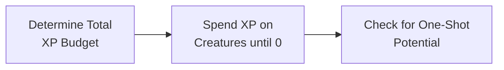

![[monster-manual-2024-banner.jpg|banner]]

# Monster Stat Calculation

## XP Budget per Character

| Party’s Level |  Low  | Moderate |  High  |
|:-------------:|:-----:|:--------:|:------:|
|       1       |  50   |    75    |  100   |
|       2       |  100  |   150    |  200   |
|       3       |  150  |   225    |  400   |
|       4       |  250  |   375    |  500   |
|       5       |  500  |   750    | 1,100  |
|       6       |  600  |  1,000   | 1,400  |
|       7       |  750  |  1,300   | 1,700  |
|       8       | 1,000 |  1,700   | 2,100  |
|       9       | 1,300 |  2,000   | 2,600  |
|      10       | 1,600 |  2,300   | 3,100  |
|      11       | 1,900 |  2,900   | 4,100  |
|      12       | 2,200 |  3,700   | 4,700  |
|      13       | 2,600 |  4,200   | 5,400  |
|      14       | 2,900 |  4,900   | 6,200  |
|      15       | 3,300 |  5,400   | 7,800  |
|      16       | 3,800 |  6,100   | 9,800  |
|      17       | 4,500 |  7,200   | 11,700 |
|      18       | 5,000 |  8,700   | 14,200 |
|      19       | 5,500 |  10,700  | 17,200 |
|      20       | 6,400 |  13,200  | 22,000 |

Using the XP Budget per Character table, cross-reference the party’s level with the desired encounter difficulty. Multiply the number in the table by the number of characters in the party to get your XP budget for the encounter.

>[!example]
>For 6 level 8 characters, a moderate difficulty encounter would be:
>
<i>1700 ⋅ 6 </i> = <i>10,200 XP</i>

>So when creating encounters for this party, I have 10,200 XP to work with.

## XP by Challenge Rating

| Challenge |   XP    |
|:---------:|:-------:|
|     0     | 0 or 10 |
|    1/8    |   25    |
|    1/4    |   50    |
|    1/2    |   100   |
|     1     |   200   |
|     2     |   450   |
|     3     |   700   |
|     4     |  1,100  |
|     5     |  1,800  |
|     6     |  2,300  |
|     7     |  2,900  |
|     8     |  3,900  |
|     9     |  5,000  |
|    10     |  5,900  |
|    11     |  7,200  |
|    12     |  8,400  |
|    13     | 10,000  |
|    14     | 11,500  |
|    15     | 13,000  |
|    16     | 15,000  |
|    17     | 18,000  |
|    18     | 20,000  |
|    19     | 22,000  |
|    20     | 25,000  |
|    21     | 33,000  |
|    22     | 41,000  |
|    23     | 50,000  |
|    24     | 62,000  |
|    25     | 75,000  |
|    26     | 90,000  |
|    27     | 105,000 |
|    28     | 120,000 |
|    29     | 135,000 |
|    30     | 155,000 |

## Calculating XP for a Monster

XP seems to be roughly set to $DPR * HP$. This will correlate to the total damage the monster can do, which is dpr x how many rounds the creature lives. Assume $2/3$ of attacks hit.

<b>XP</b> = <i>DPR ⋅ 2/3 ⋅ HP</i>

>[!example] Examples
>**Orc:** 9 DPR ⋅ $2/3$ ⋅ 15 HP = 90 XP - actual CR 1/2 (100 XP)
>
>**Barbed devil:** 22 DPR ⋅ $2/3$ ⋅ 110 HP = 1613 XP - actual CR 5 (1800 XP)
>
>**Roc:** 50 DPR ⋅ $2/3$ ⋅ 248 HP = 8267 XP - actual CR 11 (7200 XP)

Some monsters vary from this due to resistances, special powers, and how hard WOTC wants to make them.

## HP & Damage by CR

>[!info]- Monster Manual on a Business Card
>![[MM-business-card.png|float-center]]
> This business card contains all the formulas to create a creature based on the 2024 monster manual by CR.

In the 2024 Monster Manual, the formulas for HP and attack damage seems to be approximately as follows:

<b>HP</b> = <i>20 ⋅ CR + 10</i>

<b>DPR</b> = <i>8 ⋅ CR + 4</i>

